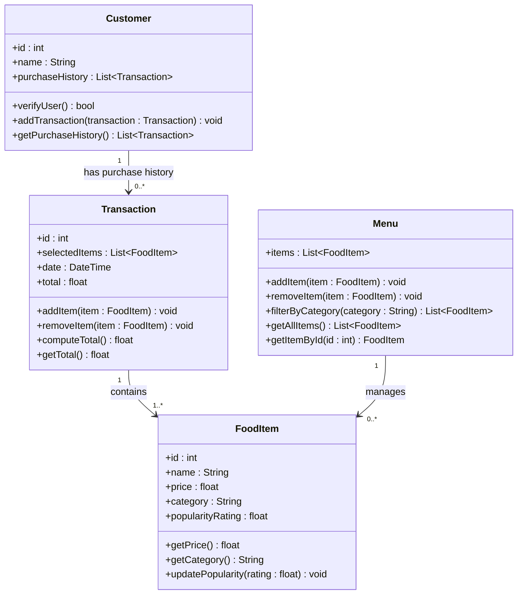

# ByteBites Design Document

ByteBites is a food-ordering system composed of exactly four classes: `Customer`, `FoodItem`,
`Menu`, and `Transaction`. This document provides a Mermaid class diagram as the primary
reference, followed by a markdown table summary for quick lookup.

---

## Primary Diagram

---

## Class Reference

### Customer

| | |
|---|---|
| **Attributes** | `+ id : int` |
| | `+ name : String` |
| | `+ purchaseHistory : List<Transaction>` |
| **Methods** | `+ verifyUser() : bool` |
| | `+ addTransaction(transaction : Transaction) : void` |
| | `+ getPurchaseHistory() : List<Transaction>` |

### FoodItem

| | |
|---|---|
| **Attributes** | `+ id : int` |
| | `+ name : String` |
| | `+ price : float` |
| | `+ category : String` |
| | `+ popularityRating : float` |
| **Methods** | `+ getPrice() : float` |
| | `+ getCategory() : String` |
| | `+ updatePopularity(rating : float) : void` |

### Menu

| | |
|---|---|
| **Attributes** | `+ items : List<FoodItem>` |
| **Methods** | `+ addItem(item : FoodItem) : void` |
| | `+ removeItem(item : FoodItem) : void` |
| | `+ filterByCategory(category : String) : List<FoodItem>` |
| | `+ getAllItems() : List<FoodItem>` |
| | `+ getItemById(id : int) : FoodItem` |

### Transaction

| | |
|---|---|
| **Attributes** | `+ id : int` |
| | `+ selectedItems : List<FoodItem>` |
| | `+ date : DateTime` |
| | `+ total : float` |
| **Methods** | `+ addItem(item : FoodItem) : void` |
| | `+ removeItem(item : FoodItem) : void` |
| | `+ computeTotal() : float` |
| | `+ getTotal() : float` |

---

## Relationships

| Association | Multiplicity | Label |
|---|---|---|
| `Customer` -> `Transaction` | 1 to 0..* | has purchase history |
| `Transaction` -> `FoodItem` | 1 to 1..* | contains |
| `Menu` -> `FoodItem` | 1 to 0..* | manages |